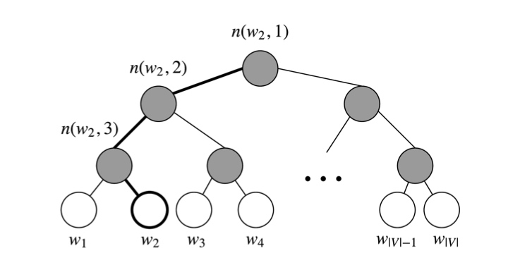

# 1. Word Embedding

"I will love you forever."

## A. One-hot encode

How to express the meaning of a word mathematically? Could we implement vectors?

Sure, a simple way is to use one-hot encode. We'll build a huge dictionary of size $N$ words. And we can reference every word by its index range from 0 to N-1. Suppose there is a word $w_i$, it's one-hot encode is a N dimensional vector where the $i$-th value is 1, and rest of them are 0s. 

But it is not a good choice for 2 reasons:
1. We could not measure the similarities of pair words by implementing normal metrics, such as cosine similarity, because vectors are orthogonal to each other or are mutually independent and different word vectors' dot product is 0. 
2. The dimension of word vector is the size of dictionary, which is too large. The vector space would be extremely sparse. 

## B. Count-based Matrix and SVD
In order to solve the problems with one-hot encode. We could utilize the statistical info gained from the text. Or in other words, we find that the meaning of a word can be determined by its context. 

<!--So now, we can define a window of a fixed size, for each center word, we search the context around the center word within the window.-->

Here are the steps for building a count-based matrix $X$:
1. We build a co-occurrence matrix $X$, there are 2 ways:
    * We can traverse whole document since we assume that words show in the same article may have strong correlation. Suppose there is a word i in article j, then in matrix X, the element $X_{i,j}$+=1. The size of this matrix is $|V| \times M$, where $|V|$ is the number of vocab, and M is the number of articles. 
    * We can also define a window, and count the co-occurrence of words. 
2. Implement SVD to decompose matrix $X$ to $USV^T$. Sort the singular values and choose top K singular values and their vectors.

This method efficiently implements all statistical information from original data. But the problem is it prefers high frequency words and can only show the correlation between words. In real life, similar words do have strong correlation, but they are more than that. 

## C. Word2Vec

In order to find a fixed size vector to represent a word (Problem in A), and also find some more complex info with these vectors which is useful for more deep research such as measuring word analogy (Problem in B). We implement prediction model, which is word2vec.

For word2vec, there are 2 different algorithms: Skip-Gram and CBOW.

#### 1. Skip Gram
> <!--In real life experience, it is quite straightforward that we can always guess the meaning of a word by few words around it.-->

> Skip-gram predicts the probability of context words from a center word.

> Take "I will love you forever." as an example, the center word is "love", and given a window size of 2. Skip-gram calculate the conditional probability of "I", "will" and "you", "forever" given this center word "love". 
> $$
> P("I", "will","you", "forever"| "love")
> $$
> If we assume that given a center word, each word in the context is independent, so 
> $$
> P("I", "will","you", "forever"| "love")=P(I| love)P(will|love)P(you| love)P(forever| love)
> $$

> Foreach word, we want to learn 2 different vectors:
> - $v$, when it is the center word;
> - $u$, when it is in the context.

>  
> <!--Suppose we have a corpus of text, we can sweep the text by a window. The word in the center of the window is denoted as $w_c$, and the words around it is denoted as $w_o$. We called measure their distance (similarities) by using conditional probabilities. Since the higher the probability, the lower the entropy. Entropy here can be think as distance. -->

> Now suppose all vectors are in $P$ dimensional space. let's denote a word i from vocabulary V as $w_i$. When it is the center word, it's vector is $v_i\in \mathbb{R}^P$, and when it is the context word, it's vector is $u_i\in \mathbb{R}^P$. 

> Now given a center word $w_c$, the probability of a context word $w_o$ is calculated by softmax:

> $$
> P(w_o|w_c) = \frac{\exp (u_o^Tv_c)}{\sum_{i\in V} \exp (u_i^Tv_c)}
> $$

> where $V = \lbrace {0,1,...,|V|-1} \rbrace$. For a text of size $T$, and window size of $m$, the likelihood given a center word $w_t$ at time $t$ is

> $$
> L(u,v) = \prod_{t=1}^{T}\prod_{-m\le j\le m,\ j\neq 0} P(w_{t+j}|w_t)
> $$

> <!--where $\theta$ here in fact is the word vector.-->

> So not our target is to maximize the log likelihood, or minimize the negative log likelihood, which is our lost function:

> $$J(u,v)=-\frac{1}{T} \sum_{t=1}^{T}\sum_{-m\le j\le m\\\\ \  \ j\neq 0} \log P(w_{t+j}|w_t)$$ 

> We can find the optimal solution by using stochastic gradient descent method. 
> 
> $U$ is the matrix of $u$ vectors. 
> $V$ is the matrix of $v$ vectors.
> $y$: the true empirical distribution $y$ is a one-hot vector with a 1 for the true outside word o, and 0 everywhere else 
> $\hat y$: the predicted distribution $\hat y$ is the probability distribution $P(O∣C=c))$ given by our model .

> $$\begin{align*}
> -\log P(w_{o}|w_c) &=-u_o^Tv_c +\log \Big({\sum_{i\in V} \exp (u_i^Tv_c)}\Big)\\\\
> \end{align*}$$

#### 2. CBOW

> Continues Bag of Words Model is similar to Skip-gram, while it predicts the probability of the center word given its context.
> $$
> P("love"|"I", "will","you", "forever")
> $$
> 
> 

#### 3. Approximation of Lost Function
> Since softmax takes all vocabularies into consideration, and $|V|$ can be size of million words. The time complexity of any update is $O(|V|)$, which is too huge.
> 
> We implement 2 ways to approximate conditional probability:
> 1. Negative Sampling
> 2. Hierarchical softmax
> 
> #### 3.1 Negative Sampling
> 
> > Instead of looping over the entire vocab, we can just sample several negative examples. We sample from noise distribution $P_n(w)$ whose probabilities match the ordering of the frequency of the vocab. 
> > 
> > Negative sampling changes the original target. Originally we measure the conditional probability $P(w_o|w_c)$, now we take the pair of $(w_o,w_c)$ as an event, and the probability of this event is
> > 
> > $$P(D=1|w_c,w_o)=\sigma(u_o^Tv_c)$$
> > 
> > where $D=1$ means the event does happen. and $\sigma$ function is sigmoid activation function.
> > 
> > $$
> > \sigma (x) = \frac{1}{1+\exp(-x)}
> > $$
> > 
> > Now, for all positive samples, we have
> > 
> > $$
> > \prod_{t=1}^{T}\prod_{-m\le j\le m,\ j\neq 0} P(D=1|w_t,w_{t+j})
> > $$
> > 
> > And for all chosen negative samples, we have
> > 
> > $$
> > \prod_{t=1}^{T}\prod_{k=1,w_k\sim P(w)}^{K} P(D=0|w_t,w_{k})
> > $$
> > 
> > where $K$ is a hyper-parameter. Normally, for small size corpus, K could be set range from 5-20, and for large corpus, K could be set as 2-5.
> > 
> > The approximate conditional probability is
> > $$
> > P(w_{t+j}|w_t)\approx  P(D=1|w_t,w_{t+j})\prod_{k=1,w_k\sim P(w)}^{K} P(D=0|w_t,w_{k})
> > $$
> > 
> > So now our target is to maximize the probability of a word and context being in the corpus data if it indeed is, and maximize the probability of a word and context not being in the corpus data if it indeed is not. (Or minimize the negative log likelihood)
> > 
> > $$\begin{align*}
> > J(u,v) = \ & - \log P(D=1|w_t,w_{t+j}) - \sum_{k=1,w_k\sim P(w)}^{K} \log P(D=0|w_t,w_{k})\\\\
> > =&\ -\log \sigma(u_{o}^Tv_c)-\sum_{k=1,w_k\sim P(w)}^{K} \log(1-\sigma(u_{k}^Tv_c))\\\\
> > =&\ -\log \sigma(u_{o}^Tv_c)-\sum_{k=1,w_k\sim P(w)}^{K} \log \sigma(-u_{k}^Tv_c)\\\\
> > \end{align*}
> > $$
> > 
> > The derivative of $J(u,v)$ with respect to $v_c$, $u_o$, and $u_k$:
> > 
> > $$\begin{align*}
> > \frac{\partial J(u,v)}{\partial v_c} &=\frac{\partial -\log \sigma(u_{o}^Tv_c)}{\partial v_c}+\frac{\partial -\sum_{k=1}^{K} \log \sigma(-u_{k}^Tv_c)}{\partial v_c}\\\\
> > &=-\frac{\sigma(u_{o}^Tv_c)(1-\sigma(u_{o}^Tv_c))}{\sigma(u_{o}^Tv_c)} u_o      +\sum_{k=1}^{K}        \frac{\sigma(-u_{k}^Tv_c)(1-\sigma(-u_{k}^Tv_c))}{  \sigma(-u_{k}^Tv_c)}u_k
> > \\
> > \\
> > &=-(1-\sigma(u_{o}^Tv_c))u_o  +\sum_{k=1}^{K} (1-\sigma(-u_{k}^Tv_c))u_k
> > \\
> > \\
> > \frac{\partial J(u,v)}{\partial u_o} &=\frac{-\log \sigma(u_{o}^Tv_c)}{\partial u_o}+\frac{-\sum_{k=1}^{K} \log \sigma(-u_{k}^Tv_c)}{\partial u_o}\\\\
> > &=-\frac{\sigma(u_{o}^Tv_c)(1-\sigma(u_{o}^Tv_c))}{\sigma(u_{o}^Tv_c)}v_c-\sum_{k=1}^{K}\frac{\sigma(-u_{k}^Tv_c)(1-\sigma(-u_{k}^Tv_c))}{\sigma(-u_{k}^Tv_c)}\\\\
> > &=-(1-\sigma(u_{o}^Tv_c))v_c
> > \\
> > \\
> > \frac{\partial J(u,v)}{\partial u_k} &=\frac{-\log \sigma(u_{o}^Tv_c)}{\partial u_k}+\frac{-\sum_{k=1}^{K} \log \sigma(-u_{k}^Tv_c)}{\partial u_k}\\\\
> > &=\sum_{k=1}^{K}\frac{\sigma(-u_{k}^Tv_c)(1-\sigma(-u_{k}^Tv_c))}{\sigma(-u_{k}^Tv_c)}v_c\\\\
> > &=\sum_{k=1}^{K}(1-\sigma(-u_{k}^Tv_c))v_c
> > \end{align*}
> > $$
> >
> >*Now the time complexity decreased from $O(|V|)$ to $O(K)$.*
> >
> >[What makes the best approximation of distribution of negative samples?]()
> >
> >We can use unigram distribution (based on frequency of each word) raised to the power of 3/4 to pick negative samples.
> >
> >$$
> >P(w_k)=\frac{f(w_k)^{3/4}}{\sum_{n=0}^{N}f(w_n)^{3/4}}
> >$$
> >
> >where $f(w_k)$ is the frequency of word k. And 3/4 is based on experience, a very intuitive example from CS224N:
> >$$
> >is:\ 0.9^{3/4}=0.92\\\\
> >Constitution:\ 0.09^{3/4}=0.16\\\\
> >bombastic:\ 0.01^{3/4}=0.032\\\\
> >$$
> >
> 
> #### 3.2 Hierarchical Softmax (From CS224n notes)
> > 
> > Hierarchical Softmax uses a Huffman binary tree where leaves are the words. Such that rare words are down in the deeper levels and frequent words are in the shallow levels.
> > 
> > There is a unique path from root to leaf, each node of the graph is associated to a vector the model is going to learn.
> > 
> > 
> > 
> > In this tree, the probability of a word w given a vector $w_i$, $P(w|w_i)$, is equal to the probability of a random walk starting in the root and ending in the leaf node corresponding to w.
> > 
> > Let's $L(w)$ be the number of nodes in the path from the root to the leaf w. For example, $L(w_2)$ in the figure is 3. $n(w,i)$ is the $i$-th node on the path with associated vector $v_n(w,i)$. So $n(w,1)$ is the root, while $n(w,L(w))$ is the father of $w$. Now for each inner node $n$, we arbitrarily choose one of its children and call it $ch(n)$ (eg. always the left node). Then, we can compute the probability as 
> > 
> > $$
> > P(w|w_i)=\prod_{j=1}^{L(w)-1}\sigma([n(w,j+1)=ch(n(w,j))])\cdot v_{n(w,j)}^Tv_{w_i}
> > $$
> > where
> > $$
> > [x]= \left\lbrace\begin{matrix}
> > 1\ if\ x\ is\ true\\\\
> > -1\ otherwise
> > \end{matrix}\right.
> > $$
> > and $\sigma(\cdot)$ is the sigmoid function.
> > 
> > The term $[n(w,j+1)=ch(n(w,j))]$ provides normalization. At a node n, if we sum the probabilities for going to the left and right node, 
> > $$
> > \sigma(x)+\sigma(-x) =1
> > $$
> > The normalization also ensures that 
> > 
> > $$
> > \sum_{w=1}^{|V|}P(w|w_i)=1
> > $$
> > 
> > We compare the similarity of our input vector $v_{w_i}$ to each inner node vector $v_{n(w,j)}^T$ using a dot product. In our example, we must take 2 left edges and then a right edge to reach $w_2$ from the root, so
> > $$
> > P(w_2|w_i) = \sigma(v_{n(w_2,1)}^Tv_{w_i}) \cdot \sigma(v_{n(w_2,2)}^Tv_{w_i}) \cdot\sigma(-v_{n(w_2,3)}^Tv_{w_i}) 
> > $$
> > 
> > To train the model, our goal is to minimize the negative log likelihood. But instead of updating output vectors per word, we update the vectors of the nodes in the binary tree that are in the path from root to leaf node.
> > 
> > Now the time complexity is only $O(log(|V|))$.

