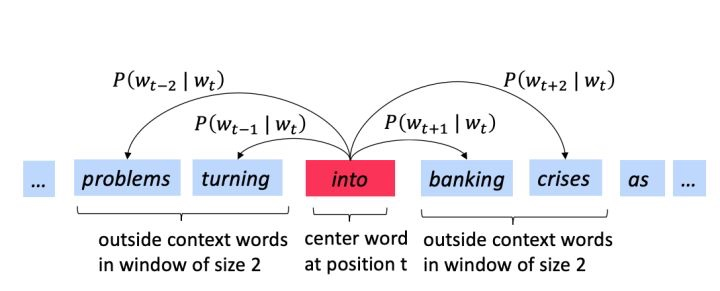
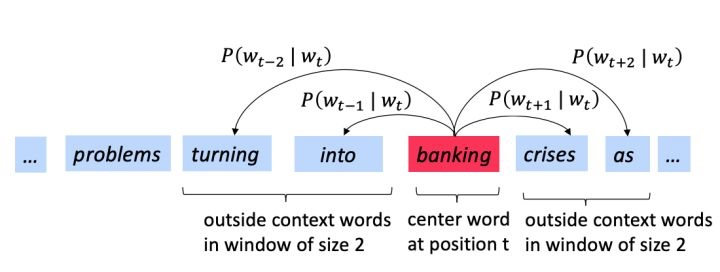

# 1. Word Vector

How to represent the meaning of a word mathematically?

Could we implement vectors?

One simple way is to use one-hot encode. But the dimension of each vector is the size of corpus, and vectors are orthogonal to each other. We cannot measure the similarity of two vectors if they are mutually independent. 

Then we found that the meaning of a word can be determined by its context. We can define a window of a fixed size, and find the context within the window.

One defect of one-hot encode is that the dimension is too high, or the it is a sparse vector. We want to build a dense vector that not only reduce dimension, but keep similarities between word vectors. That's where we use word embedding tech.

## Word2Vec

#### Skip Gram
Suppose we have a corpus of text, we can sweep the text by a window. The word in the center of the window is denoted as $w_c$, and the words around it is denoted as $w_o$. We called measure their distance (similarities) by using conditional probabilities. Since the higher the probability, the lower the entropy. Entropy here can be think as distance. 

For example, into is the center word, and window size is 2,

When we move to the next word, banking is the center word. We will continue calculate the conditional probability of each center word against its context.

BTW, each word has two vector, one is the vector when it is the center word $v_w$, one is the vector when it is in the context $u_w$.

The likelihood of $\theta$ is:

$$
L(\theta) = \prod_{t=1}^{T}\prod_{-m\le j\le m\\\\ \  \ j\neq 0} P(w_{t+j}|w_t;\theta)
$$

where $m$ is the window size. 

Each conditional probability is,

$$
P(O=o|C=c) = \frac{\exp (u_o^Tv_c)}{\sum_{w\in Vocad} \exp (u_w^Tv_c)}
$$

So our target is to minimize lost function,

$$J(\theta)  = -\frac{1}{T}\log L(\theta) = -\frac{1}{T} \sum_{t=1}^{T}\sum_{-m\le j\le m\\\\ \  \ j\neq 0} \log P(w_{t+j}|w_t;\theta)$$ 

#### CBOW

Similar to Skip-Gram

