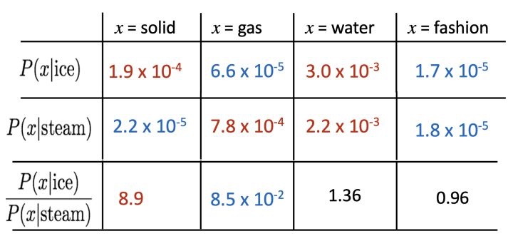

# 2. GloVe Not finished

Word2Vec is a direct prediction model that based on local context. While there is another kind of model called count based global matrix factorization. 

## SVD

First we build a co-occurrence matrix $X$, then use SVD to decompose it as $USV^T$.

How to build a matrix $X$?

1. We can traverse whole document. We assume that words show in the same article may have strong correlation. Suppose word i in article j, then in matrix X, the element $X_{i,j}$+=1. The size of this matrix is $|V| \times M$, where $|V|$ is the number of vocab, and M is the number of articles.  
2. We can also define a window, and count the co-occurrence of words.

When we have a huge document, the size of matrix $X$ would be extremely huge. That is the reason why we implement SVD to reduce dimension.

## GloVe

For count based model like SVD, it is easy to train, and it efficiently utilize all statistical info. But this model prefer high frequency words, and can only show the correlation of words. 

For Word2Vec, it's embedded some more complex info which is useful for more deep research such as measuring word analogy. But it does not utilize the whole statistical info.

How to fully utilize statistical info and learn more knowledge rather than correlation?

First let's denote a matrix $X$, $X_{i,j}$ means the occurrence of word j when it is in the context of word i. So that $X_i=\sum_{k}X_{i,k}$ mean the sum of occurrence of words in the context of i. $P_{i,j}=P(j|i)=\frac{X_{i,j}}{X_i}$ means the probability of word j given it's center word i.

As shown in the figure, the conditional probability of solid is pretty low given ice or steam. But the ratio between these two probabilities is higher than others. This shows that solid is more likely to show close to ice rather than steam, which makes sense. For water, ice and steam are the different form of water, it is even likely to show around ice and steam. But for gas and fashion, they are not even having some links, so they are even likely to show around ice and steam too.

Besides simple co-occurrence probability, the ratio of probabilities has more interesting information. 

So now, let's define a function $F$

$F(w_i,w_j,\widetilde{w}_k)=\frac{P_{i,k}}{P_{j,k}}$

Not finished 