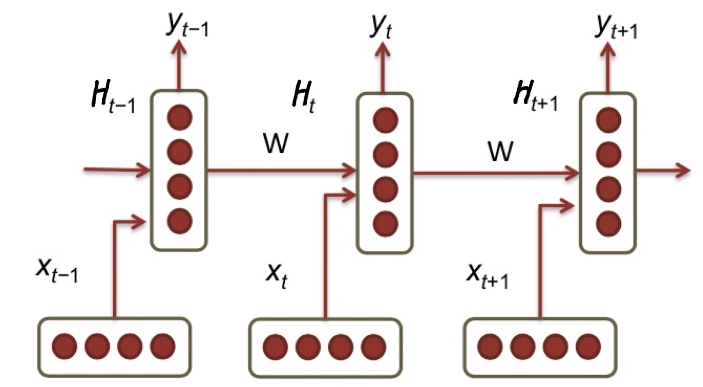
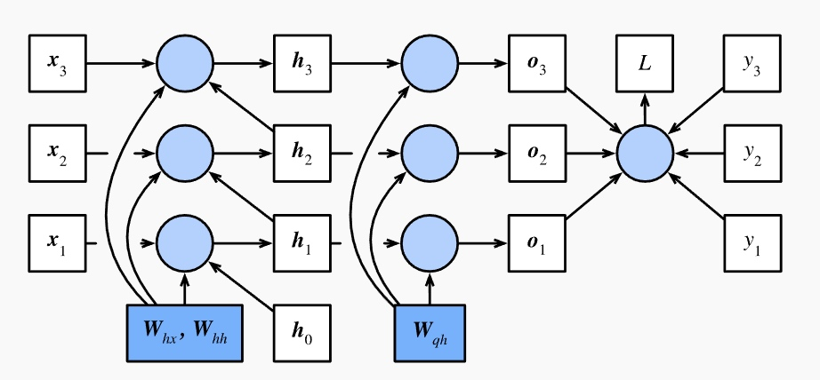
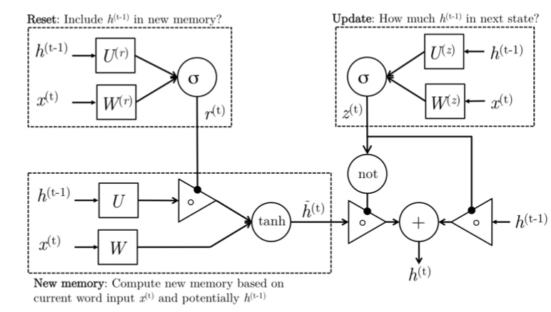
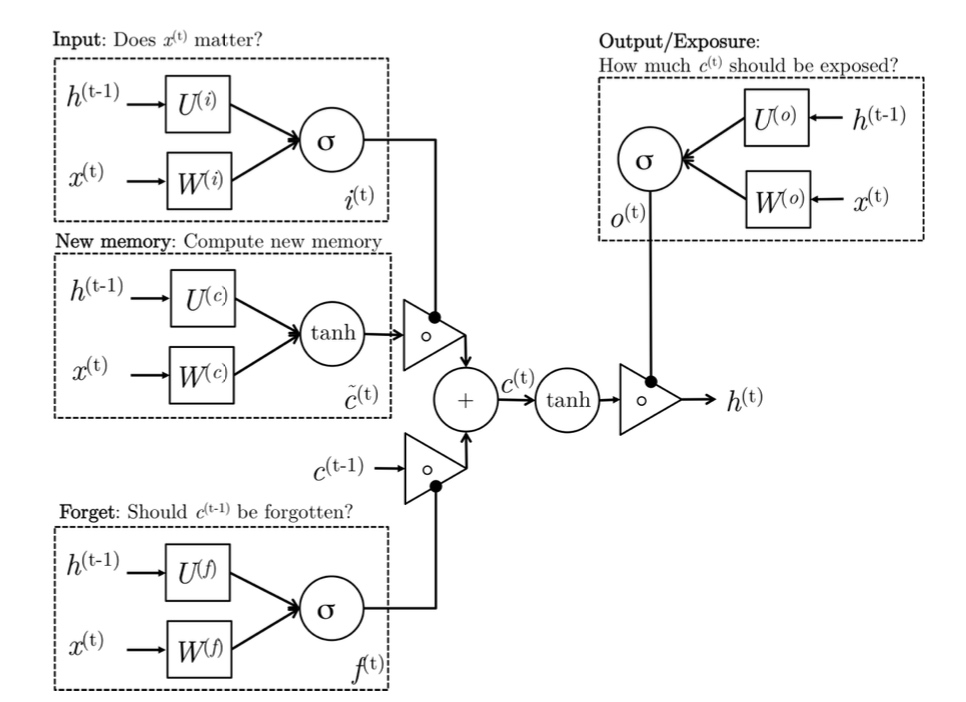

# 2. Language model, RNNs, GRU & LSTM

**Note:** Most content are based on CS224n lecture and notes.

## 1. Language model

### 1.1 Introduction

 Language models compute the probability of occurrence of a number of words in a particular sequence. Suppose a sequence of $T$ words $\lbrace w_1,w_2,...,w_T\rbrace$, its probability is denoted as $P(w_1,w_2,...,w_T)$. 
 $$
 P(w_1,w_2,...,w_T) = \prod_{t=1}^{T}P(w_t|w_1,...,w_{t-1})
 $$

### 1.2 n-gram language model

Since the number of words coming before a word varies depending on its location in the input document, $P(w_1,w_2,...,w_T)$ is usually conditioned on a window of $n$ previous words rather than all previous words. Base on Markov Assumption, the probability of a word follows the rule of Markov chain of order n, while it may not always holds.
$$
P(w_1,w_2,...,w_T)\approx \prod_{t=1}^{T} P(w_t|w_{t-(n-1)},...,w_{t-1})
$$
To compute this probability, the count of each n-gram could be compared against the frequency of each word. This is called an n-gram Language Model.

For example, if the model takes bi-grams, the frequency of each bi-gram, calculated via combining a word with its previous word, would be divided by the frequency of the corresponding uni-gram. 

For bi-gram:
$$
P(w_2|w_1) = \frac{count(w_1,w_2)}{count(w_1)}
$$

Tri-gram:
$$
P(w_3|w_1,w_2) = \frac{count(w_1,w_2,w_3)}{count(w_1,w_2)}
$$

And the overall probability is:

Uni-gram:
$$
P(w_1,w_2,w_3,w_4) = P(w_1)P(w_2)P(w_3) P(w_4)
$$

Bi-gram:
$$
P(w_1,w_2,w_3,w_4) = P(w_1)P(w_2|w_1)P(w_3|w_2)P(w_4|w_3)
$$

Tri-gram:
$$
P(w_1,w_2,w_3,w_4) = P(w_1)P(w_2|w_1)P(w_3|w_2,w_1)P(w_4|w_3,w_2)
$$

**How to determine $n$?**

> If $n$ is small, it will focus more on close words rather than sentence structure or grammar. In the example from CS224n, consider the sentence "As the proctor started the clock, the students opened their ___ ". If the window only conditions on the previous three words "the students opened their", the probabilities calculated based on the corpus may suggest that the next word be "books" - however, if n had been large enough to include the "proctor" context, the probability might have suggested "exam".

> This leads us to two main issues with n-gram Language Models: Sparsity and Storage.

**1. Sparsity problems with n-gram Language models**

> Sparsity problems with these models arise due to two issues.
> 
> Firstly, for equation $P(w_3|w_1,w_2) =\frac{count(w_1,w_2,w_3)}{count(w_1,w_2)}$. If $w_1$, $w_2$ and $w_3$ never appear together in the corpus, the probability of $w_3$ is 0. To solve this, a small $\delta$ could be added to the count for each word in the vocabulary. This is called smoothing.
> 
> Secondly, consider the denominator of $count(w_1,w_2)$. If $w_1$ and $w_2$ never occurred together in the corpus, then no probability can be calculated for $w_3$. To solve this, we could condition on $w_2$ alone. This is called backoff.
> 
> Increasing $n$ makes sparsity problems worse. Typically, n ≤ 5.
> 
> 

**2. Storage problems with n-gram Language models**

> We know that we need to store the count for all n-grams we saw in the corpus. As n increases (or the corpus size increases), the model size increases as well.

## 2. RNN

RNN captures all previous words in the corpus.

(Source: http://cs224d.stanford.edu/)

Now, suppose each word is a $d$-D vector, $X_t\in \mathbb{R}^{n\times d}$ is a batch of n word vectors at time $t$. $H_t \in \mathbb{R}^{n\times h}$ is the matrix of $h$ hidden variables at time $t$. At each time-step, there are 3 inputs to the hidden layer:
* The output of previous layer $H_{t-1}$
* The input at that time-step $X_t$
* The bias term $b_h \in \mathbb{R}^{1\times h}$

The former input is multiplied by a weight matrix $W_{hh} \in \mathbb{R}^{h\times h}$, and latter by a weight matrix $W_{hx} \in \mathbb{R}^{d\times h}$ to produce output feature $H_t$, which are multiplied with a weight matrix $W_{oq}\in \mathbb{R}^{h\times q}$ plus a bias term $b_q \in \mathbb{R}^{1\times q}$ and run through a softmax over the vocabulary to obtain a prediction output $\hat y$ of the next word. 

$$
H_{t} = \sigma(X_tW_{hx}+H_{t-1}W_{hh}+b_h)
$$
$$
\hat{y}_t= softmax( H_{t} W_{oq} + b_q)
$$

The same weights $W_{hh}\in \mathbb{R}^{h\times h}$, $W_{hx}\in \mathbb{R}^{d\times h}$ ,$W_{oq}\in \mathbb{R}^{h\times q}$ and bias $b_h\in \mathbb{R}^{1\times h}$, $b_q\in \mathbb{R}^{1\times q}$ are applied repeatedly at each time-step. Thus, the number of parameters the model has to learn is less, and most importantly, is independent of the length of the input sequence - thus defeating the curse of dimensionality!

### 2.1 Model Computation Graph

In this simplified model, we ignore bias terms and regularization terms. We denote $h_t$ as the hidden layer, $x_t$ as the input, $o_t$ as the output at time-step t. $W_{hx}$, $W_{hh}$ and $W_{op}$ multiply input, hidden layer and output respectively. 

(Source: https://zh.d2l.ai/chapter_recurrent-neural-networks/bptt.html)

In this graph, the time-steps is 3.

### 2.2 RNN Loss and Perplexity

#### 2.2.1 Loss

We use **Cross Entropy** to calculate the loss. 

A quick reminder of cross entropy, it measures the entropy of a predict distribution $q_k$ given a real distribution $p_k$.
$$
\sum_{k=1}^{N}p_k \log \frac{1}{q_k} = -\sum_{k=1}^{N}p_k \log q_k
$$

When the $q_k=p_k$, the cross entropy is the lowest.

In this case, the loss function over the entire vocabulary at time-step $t$ is

$$
J_t(\theta) = -\sum_{j=1}^{|V|} y_{t,j}\log (\hat y_{t,j})
$$

The cross entropy error over a corpus of size $T$ is:
$$
J=\frac{1}{T}\sum_{t=1}^{T}J_t(\theta)= -\frac{1}{T}\sum_{t=1}^{T} \sum_{j=1}^{|V|} y_{t,j}\log (\hat y_{t,j})
$$

#### 2.2.2 Perplexity

Perplexity is basically 2 to the power of the negative log probability of the cross entropy error function. Perplexity is a measure of confusion where lower values imply more confidence in predicting the next word in the sequence (compared to the ground truth outcome).

$$
Perplexity = 2^J
$$

It can be best understood as the harmonic mean of the number of real choices that we have when deciding which word to pick next. 

<!--In the best case scenario, the model always estimates the probability of the next symbol as  1 . In this case the perplexity of the model is  1 .

In the worst case scenario, the model always predicts the probability of the label category as 0. In this situation, the perplexity is infinite.

At the baseline, the model predicts a uniform distribution over all tokens. In this case, the perplexity equals the size of the dictionary len(vocab). In fact, if we were to store the sequence without any compression, this would be the best we could do to encode it. Hence, this provides a nontrivial upper bound that any model must satisfy.-->

### 2.3 Forward-Propagation

Here we slightly change the shape of each variable and parameter:

1. Input
    * $x_t \in \mathbb{R}^{d\times n}$
    * $W_{hx} \in \mathbb{R}^{h\times d}$
    * $W_{hx}x_t \in \mathbb{R}^{d\times n}$
2. Hidden Layer
    * $h_t \in \mathbb{R}^{h\times n}$
    * $W_{hh} \in \mathbb{R}^{h\times h}$
    * $W_{hh}h_t \in \mathbb{R}^{h\times n}$
3. Output
    * $W_{qh} \in \mathbb{R}^{q \times h}$
    * $o_t \in \mathbb{R}^{q\times q\times n}$ 
    * $o_t = W_{oh}h_t$
4. Loss
    * $L \in \mathbb{R}$

Calculate $h$: 
$$
h_t = \sigma(W_{hx}x_t+W_{hh}h_{t-1})
$$

Calculate $o$:

$$
o_t=W_{qh}h_t
$$

Calculate loss:

$$
L=\frac{1}{T}\sum_{t=1}^{T}l(o_t,y_t)
$$

### 2.4 Back-Propagation

1. $\frac{\partial L}{\partial o_t}$

$$
\frac{\partial L}{\partial o_t}=\frac{\partial l(o_t,y_t)}{T \partial o_t}
$$

2. $\frac{\partial L}{\partial W_{qh}}$

$$\begin{align*}
\frac{\partial L}{\partial W_{qh}}&=prod(\frac{\partial L}{\partial o_t},\frac{\partial o_t}{\partial W_{qh}})\\\\
&=\sum_{t=1}^{T}\frac{\partial L}{\partial o_t}\cdot h_t^T
\end{align*}
$$

3. $\frac{\partial L}{\partial h_t}$

    First calculate the last one $\frac{\partial L}{\partial h_{T}}$:
$$\begin{align*}
\frac{\partial L}{\partial h_{T}} &= prod(\frac{\partial L}{\partial o_T},\frac{\partial o_T}{\partial h_{T}})\\\\
&=W_{qh}^T\cdot \frac{\partial L}{\partial o_{T}}
\end{align*}
$$
    Then calculate the second last one $\frac{\partial L}{\partial h_{T-1}}$, it has two path, one is through $o_{T-1}$, and one is through $h_T$:
    $$\begin{align*}
\frac{\partial L}{\partial h_{T-1}} &= prod(\frac{\partial L}{\partial o_{T-1}},\frac{\partial o_{T-1}}{\partial h_{T-1}})+prod(\frac{\partial L}{\partial h_T},\frac{\partial h_T}{\partial h_{T-1}})\\\\
&=W_{qh}^T\cdot \frac{\partial L}{\partial o_{T-1}} + W_{hh}^T\cdot \frac{\partial L}{\partial h_{T}}
\end{align*}
$$
    So generally,
    $$\begin{align*}
\frac{\partial L}{\partial h_{t}} &=W_{qh}^T\cdot \frac{\partial L}{\partial o_{t}} + W_{hh}^T\cdot \frac{\partial L}{\partial h_{t+1}}
\end{align*}
$$
    And this is a recursion function, finally
    $$\begin{align*}
\frac{\partial L}{\partial h_{t}} &=\sum_{i=t}^{T}(W_{hh}^T)^{T-i} \cdot W_{qh}^T\cdot  \frac{\partial L}{\partial o_{T+t-i}}
\end{align*}
$$
    

4. $\frac{\partial L}{\partial W_{hx}}$

$$\begin{align*}
\frac{\partial L}{\partial W_{hx}}=\sum_{t=1}^{T} \frac{\partial L}{\partial h_t}\cdot x_t^T
\end{align*}
$$

5. $\frac{\partial L}{\partial W_{hh}}$

$$\begin{align*}
\frac{\partial L}{\partial W_{hh}}=\sum_{t=1}^{T} \frac{\partial L}{\partial h_t}\cdot h_{t-1}^T
\end{align*}
$$

### 2.5 Vanishing Gradient & Gradient Explosion Problems

As shown in 2.4, when expanding $T$, the computation of $\frac{\partial L}{\partial h_t}$ increase exponentially. 

$\frac{\partial L}{\partial h_t}$ could easily become a very small number if the exponential term is less than 1 (**Vanishing: Undetective**) or a very large number if it is larger than 1. (**Gradient Explosion**)

### 2.6 Solutions 

#### 2.6.1 Gradient Explosion

In this case, we implement **Gradient Clipping** to clip gradients to a small number whenever they explode.
$$
min\Big(\frac{\theta}{||g||},1\Big)g
$$
where $\theta$ is a threshold, the $L2$ norm of gradient $g$ after clipping should not exceed $\theta$.

----

$g \leftarrow \frac{\partial L}{\partial W}$ 

if $||g||>\theta$, then

$\ \ $ $ g = \frac{\theta}{||g||}g$

end if 

----

##### 2.6.2 Vanishing Gradient

1. ReLU or Leaky ReLU instead of Sigmoid or Tanh
2. Start off from an identity matrix initialization instead of initializing $W_{hh}$ randomly. 

<!--### 2.7 Deep RNNs

-->

### 2.7 Gated Recurrent Units

Besides using more complex units fro activation, we could modify the RNN architecture by using a gated activation function. 

<!--Gated recurrent units are designed to capture long term memories. -->

* New memory generation: A new memory $\tilde{h}_t$ is simply the consolidation of a new input and the weighted previous hidden state.

* Reset gate: The reset signal $r_t$ is to determine how important the previous hidden state to the new memory $\tilde{h}_t$. This gate is for capturing the short time memory.

* Update gate: The update signal $z_t$ is to how much new memory and previous hidden state should be carried to the next hidden state. If $z_t=0$, then only new memory is forwarded, while if $z_t=1$, then only the previous hidden state is forwarded. This gate is for capturing the long time memory.

The shape of each variable and parameter:
1. Date
    * $x_t \in \mathbb{R}^{d\times n}$
    * $h_{t-1} \in \mathbb{R}^{h\times n}$
2. Reset Gate
    * $W_{r} \in \mathbb{R}^{h\times d}$
    * $U_{r} \in \mathbb{R}^{h\times h}$
    * $b_r \in \mathbb{R}^{1\times h}$
3. Update Gate
    * $W_{z} \in \mathbb{R}^{h\times d}$
    * $U_{z} \in \mathbb{R}^{h\times h}$ 
    * $b_z \in \mathbb{R}^{1\times h}$
4. New Memory
    * $W_{} \in \mathbb{R}^{h \times d}$
    * $U_{} \in \mathbb{R}^{h \times h}$
    * $b \in \mathbb{R}^{1 \times h}$
    
Reset gate signal:
$$
r_t = \sigma(W_{r}x_t+U_rh_{t-1}+b_r)
$$

Update gate signal:
$$
z_t = \sigma(W_zx_t + U_zh_{t-1}+b_z)
$$

New memory:
$$
\tilde{h}_t=\tanh(Wx_t+Uh_{t-1}\odot r_t + b)
$$

Hidden state:
$$
h_t=z_t\odot h_{t-1} + (1-z_t)\odot \tilde{h}_t
$$

### 2.8 LSTM

Long short term memory model has 3 gates: input gate, forget gate and output gate.

New memory generation: Simply use the past hidden state and new input to form the new memory $\tilde{c}_t$.

Input gate: The input gate signal $i_t$ determine whether or not the input is worth keeping.

Forget gate: The forget gate is similar to the input gate, but it determine whether or not the past memory cell $c_{t-1}$ is useful for the computation of the current memory cell. $f_t$ 

Final memory generation: Use the forget gate to determine if the past memory should be forgotten or not, and use the input gate to determine if the new memory is important or not. Sum them up to the final memory $c_t$.

Output gate: Separate the final memory from the hidden state. Hidden states are used in every single gate of an LSTM and thus, this gate makes the assessment regarding what parts of the memory $c_t$ needs to be exposed in the hidden state $h_t$. The output gate signal is denoted as $o_t$.

The shape of each variable and parameter:
1. Date
    * $x_t \in \mathbb{R}^{d\times n}$
    * $h_{t-1} \in \mathbb{R}^{h\times n}$
2. Input Gate
    * $W_{i} \in \mathbb{R}^{h\times d}$
    * $U_{i} \in \mathbb{R}^{h\times h}$
    * $b_i \in \mathbb{R}^{1\times h}$
3. Forget Gate
    * $W_{f} \in \mathbb{R}^{h\times d}$
    * $U_{f} \in \mathbb{R}^{h\times h}$ 
    * $b_f \in \mathbb{R}^{1\times h}$
4. New Memory
    * $W_{c} \in \mathbb{R}^{h \times d}$
    * $U_{c} \in \mathbb{R}^{h \times h}$
    * $b_c \in \mathbb{R}^{1 \times h}$
5. Output Gate
    * $W_{o} \in \mathbb{R}^{h \times d}$
    * $U_{o} \in \mathbb{R}^{h \times h}$
    * $b_{o} \in \mathbb{R}^{1 \times h}$
    
Input Gate signal:
$$
i_t = \sigma(W_{i}x_t+U_ih_{t-1}+b_i)
$$

Forgate gate signal:
$$
f_t = \sigma(W_fx_t + U_fh_{t-1}+b_f)
$$

New memory:
$$\tilde{c}_t=\$$

$$\tilde{c}_t=\tanh(W_cx_t+U_ch_{t-1}+b_c)$$

Final memory cell:

$$c_t=\tilde{c}_t\odot i_t+c_{t-1}\odot f_t$$

Output gate:
$$
o_t = \sigma(W_ox_t+U_oh_{t-1}+b_o)
$$

Hidden State:
$$
h_t = \tanh(c_t) \odot o_t
$$